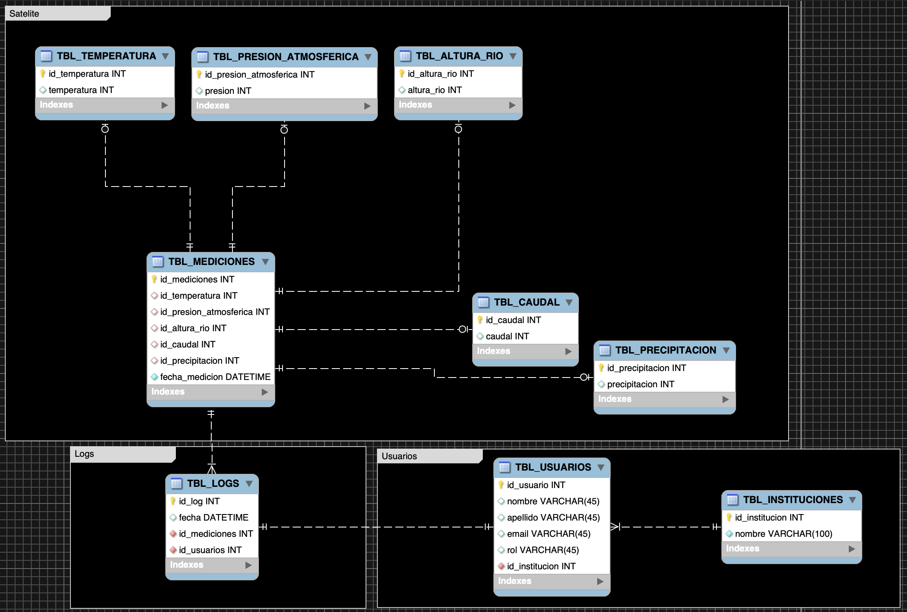

# SPACETHON reto grupal

## Base de datos

Este repositorio esta conformado con los archivos necesarios para armar la base de datos que usa el [REST API](https://github.com/Misael1998/spacethon-grupal-api) que se hizo para el reto.
 

Se usa SQLSeverExpress como gestor de base de datos, ya que es sencillo de usar e implementar.

## El modelo relacional es el siguiente:

